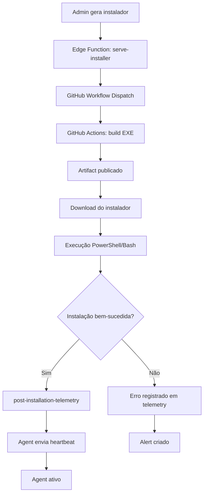
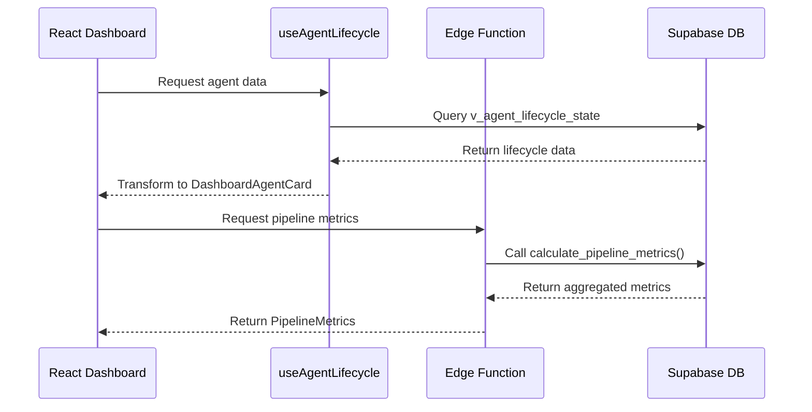
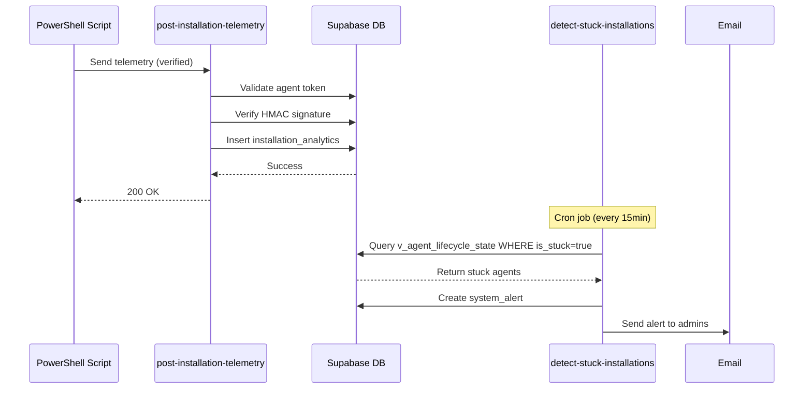
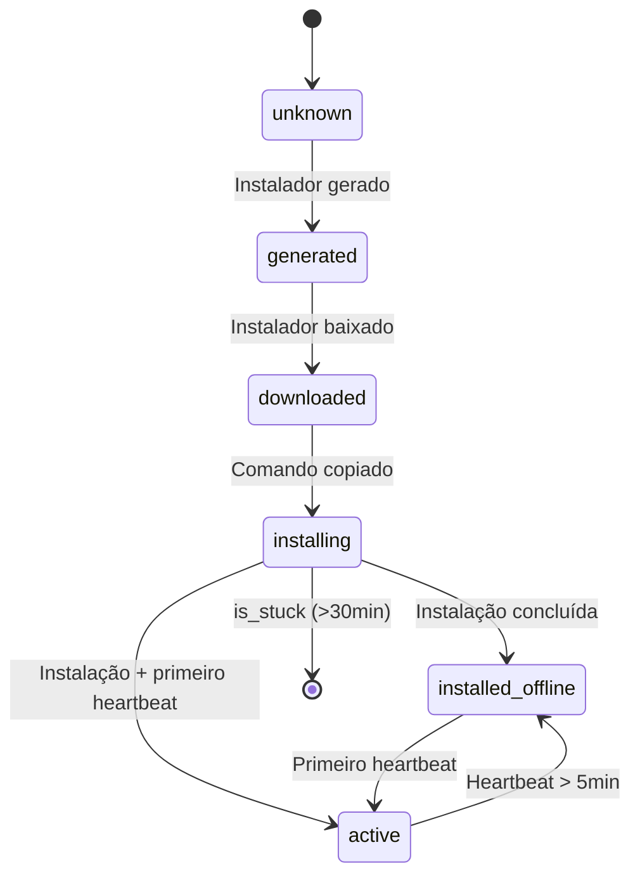

# CyberShield - Arquitetura de Fluxo de Dados

## Visão Geral

Este documento descreve o fluxo completo de dados no sistema CyberShield, do momento em que um instalador de agente é gerado até o agente estar ativo e enviando heartbeats.

## Pipeline de Instalação de Agentes



## Contratos de Dados

### 1. Agent Lifecycle State

**Fonte**: View `v_agent_lifecycle_state`  
**Consumidores**: 
- Frontend dashboards
- Edge Functions de métricas
- Alertas automáticos

**Estrutura**:
```typescript
interface AgentLifecycleState {
  agent_id: string;
  agent_name: string;
  lifecycle_stage: 'unknown' | 'generated' | 'downloaded' | 'installing' | 'installed_offline' | 'active';
  generated_at: string | null;
  downloaded_at: string | null;
  command_copied_at: string | null;
  installed_at: string | null;
  is_stuck: boolean;
  last_error_message: string | null;
  installation_time_seconds: number | null;
}
```

### 2. Installation Telemetry Payload

**Fonte**: PowerShell/Bash scripts  
**Destino**: Edge Function `post-installation-telemetry`

**Estrutura**:
```typescript
interface InstallationTelemetryPayload {
  agent_token: string;
  agent_name: string;
  success: boolean;
  platform: 'windows' | 'linux';
  installation_time_seconds: number;
  network_tests?: {
    health_check_passed: boolean;
    heartbeat_endpoint_ok: boolean;
    tls_version: string;
  };
  error_type?: '401_unauthorized' | 'tls_error' | 'proxy_error' | 'script_error';
  error_message?: string;
  installation_logs?: {
    stdout: string[];
    stderr: string[];
  };
}
```

### 3. Pipeline Metrics

**Fonte**: SQL Function `calculate_pipeline_metrics`  
**Destino**: Edge Function `get-installation-pipeline-metrics`

**Estrutura**:
```typescript
interface PipelineMetrics {
  total_generated: number;
  total_downloaded: number;
  total_command_copied: number;
  total_installed: number;
  total_active: number;
  total_stuck: number;
  success_rate_pct: number;
  avg_install_time_seconds: number;
  conversion_rate_generated_to_installed_pct: number;
  conversion_rate_copied_to_installed_pct: number;
}
```

## Fluxo de Comunicação entre Camadas

### Frontend → Backend



### Agent Installation → Backend



## Pontos de Integração Críticos

### 1. Enrollment Token Validation
- **Onde**: `serve-installer`, `enroll-agent`
- **Validação**: Token de 64 caracteres, ativo, não expirado
- **Segurança**: HMAC secret único por agent

### 2. Post-Installation Telemetry
- **Onde**: `post-installation-telemetry`
- **Modos**: Verified (com HMAC) e Unverified (fallback)
- **Deduplicação**: `telemetry_hash` (agent_name + timestamp)

### 3. Health Checks
- **Heartbeat**: A cada 60s, endpoint `/heartbeat`
- **System Metrics**: A cada 5min, endpoint `/submit-system-metrics`
- **Detecção Offline**: Heartbeat > 5min = offline

### 4. Stuck Installation Detection
- **Critério**: `command_copied` há > 30min sem `post_installation`
- **Ação**: Alert criado + Email enviado aos admins
- **Frequência**: Cron job a cada 15 minutos

## Estado de Agente (Lifecycle Stages)



## Dashboards e Fontes de Dados

### Installation Pipeline Monitor
- **Fonte**: `v_agent_lifecycle_state` + `calculate_pipeline_metrics()`
- **Update**: Refetch a cada 60s
- **Features**: Funil visual, métricas KPI, tabela detalhada

### Agent Health Monitor
- **Fonte**: `v_agent_lifecycle_state` + Supabase Realtime
- **Update**: Realtime (heartbeats ao vivo)
- **Features**: Heatmap de status, contador live, grupos por saúde

### Installation Logs Explorer
- **Fonte**: `installation_analytics` table
- **Update**: On-demand (via filtros)
- **Features**: Busca avançada, drill-down, exportação CSV

### System Logs
- **Fonte**: `system_alerts` + `security_logs`
- **Update**: Refetch a cada 60s
- **Features**: Filtros por tipo/severidade/data, status de resolução

## Tolerância a Falhas

### Telemetria Não Verificada
- Quando o HMAC falha ou token inválido
- Registra em `installation_analytics` com `event_type='post_installation_unverified'`
- Permite diagnóstico mesmo com falha de autenticação

### Rate Limiting
- Heartbeats: 60 requests/min por agent
- Telemetria: 10 requests/min por agent
- Implementado em `rate_limits` table

### Retry Logic
- Scripts tentam até 3x enviar telemetria
- Intervalo exponencial: 5s, 10s, 20s
- Fallback para modo unverified após falhas

## Métricas de Performance

### Targets
- **Success Rate**: > 85% instalações bem-sucedidas
- **Avg Install Time**: < 120s
- **Heartbeat Latency**: < 2s
- **Stuck Rate**: < 5% agentes travados

### Monitoramento
- **Alertas Automáticos**: 
  - Taxa de falha > 30% nas últimas 24h
  - Agentes travados > 30min
  - Heartbeat ausente > 10min (agents críticos)

## Segurança

### RLS Policies
- Todas as views usam `security_invoker = true`
- Funções SQL usam `SECURITY DEFINER` com `search_path = public`
- Tokens nunca são expostos em logs (mascarados com `***`)

### HMAC Validation
- Algoritmo: SHA256
- Headers: `X-HMAC-Signature`, `X-Timestamp`, `X-Nonce`
- TTL: 5 minutos
- Replay protection: Nonce único armazenado em `hmac_signatures`

## Referências

- [Tipos TypeScript](../src/types/agent-lifecycle.ts)
- [Hook Principal](../src/hooks/useAgentLifecycle.tsx)
- [Edge Functions](../supabase/functions/)
- [SQL Views](../supabase/migrations/)
