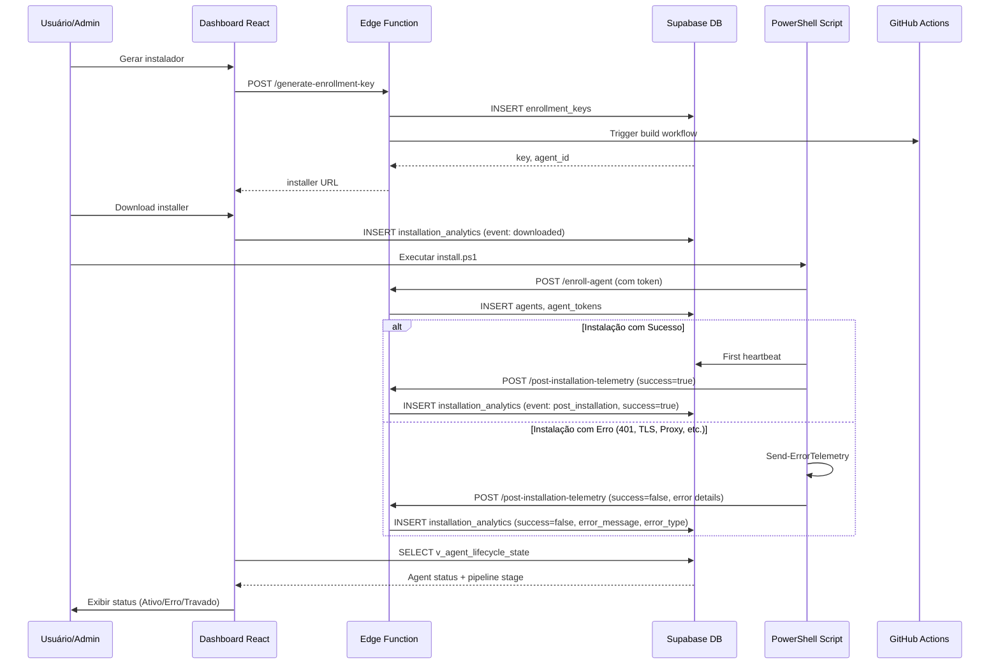
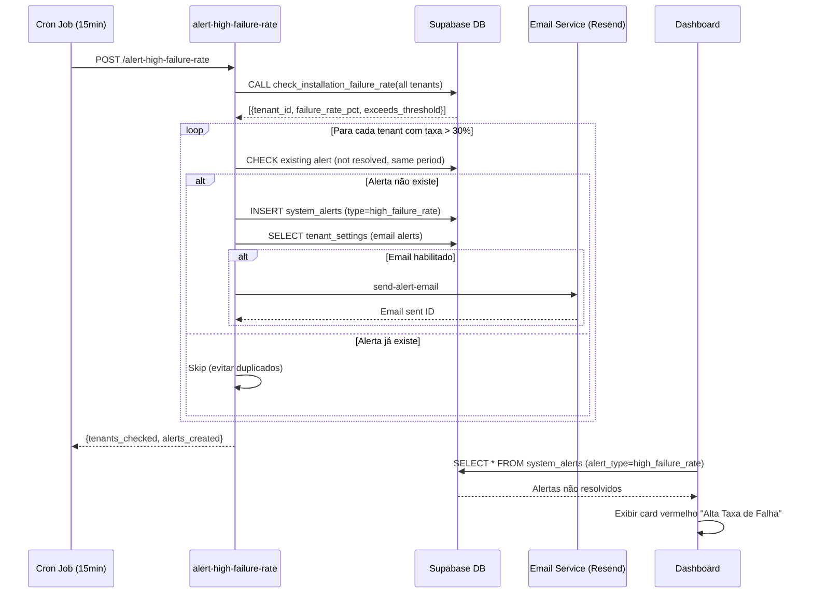

# Data Flow Architecture - CyberShield (Atualizado)

## 🔄 Fluxos de Dados Completos

### 1. Pipeline de Instalação (Atualizado com Telemetria de Erros)



### 2. Alertas de Taxa de Falha Alta (NOVO)



### 3. Dashboard de Monitoramento (Queries Otimizadas)

```mermaid
graph TB
    D[Dashboard React] --> H[useAgentLifecycle Hook]
    D --> P[usePipelineMetrics Hook]
    D --> F[useFailureRate Hook]
    
    H -->|SELECT * WHERE tenant_id| V[v_agent_lifecycle_state]
    P -->|POST /get-installation-pipeline-metrics| EF[Edge Function]
    F -->|RPC check_installation_failure_rate| DB[Supabase RPC]
    
    V -->|Index: idx_agents_tenant_enrolled| A[agents table]
    V -->|Index: idx_installation_analytics_tenant_created| IA[installation_analytics table]
    
    EF -->|RPC calculate_pipeline_metrics| DB
    DB -->|Aggregate KPIs| EF
    EF -->|{success_rate, avg_time, conversion}| P
    
    DB -->|{failure_rate_pct, exceeds_threshold}| F
    
    H --> R[React Components]
    P --> R
    F --> R
    
    R --> IPM[Installation Pipeline Monitor]
    R --> AHM[Agent Health Monitor]
    R --> ILE[Installation Logs Explorer]
    
    style V fill:#f9f,stroke:#333,stroke-width:2px
    style EF fill:#bbf,stroke:#333,stroke-width:2px
    style R fill:#bfb,stroke:#333,stroke-width:2px
```

---

## 📦 Contratos de Dados Atualizados

### Edge Function: `post-installation-telemetry`
**Input (PowerShell → Backend):**
```typescript
{
  agent_token: string; // UUID
  agent_name: string;
  success: boolean; // ✅ NOVO: suporta false
  platform: "windows" | "linux";
  installation_time_seconds: number;
  installation_method: "powershell" | "bash";
  
  // ✅ NOVO: Campos de erro
  error_type?: "401_unauthorized" | "tls_error" | "proxy_error" | "network_timeout" | "script_error" | ...;
  error_message?: string;
  
  installation_logs?: {
    stdout: string[];
    stderr: string[];
  };
  
  system_info: {
    os_version: string;
    powershell_version?: string;
    hostname: string;
    admin_privileges: boolean;
  };
}
```

### SQL Function: `check_installation_failure_rate`
**Input:**
```sql
p_tenant_id UUID DEFAULT NULL,  -- NULL = all tenants
p_hours_back INTEGER DEFAULT 1,
p_threshold_pct NUMERIC DEFAULT 30.0
```

**Output:**
```sql
{
  tenant_id UUID,
  total_attempts BIGINT,
  failed_attempts BIGINT,
  failure_rate_pct NUMERIC,  -- 0-100
  exceeds_threshold BOOLEAN,
  period_start TIMESTAMP,
  period_end TIMESTAMP
}
```

### React Hook: `useFailureRate`
**Retorno:**
```typescript
{
  data: {
    tenant_id: string;
    total_attempts: number;
    failed_attempts: number;
    failure_rate_pct: number;
    exceeds_threshold: boolean;
    period_start: string; // ISO timestamp
    period_end: string;
  } | null;
  isLoading: boolean;
  isError: boolean;
  error: Error | null;
  refetch: () => void;
}
```

---

## 🔐 Segurança e RLS

### Políticas Aplicadas

**v_agent_lifecycle_state:**
- ✅ Admins: `SELECT WHERE tenant_id = current_user_tenant_id()`
- ✅ Super Admins: `SELECT ALL`
- ❌ Operators/Viewers: Sem acesso direto (via Edge Functions)

**installation_analytics:**
- ✅ Admins: `SELECT WHERE tenant_id = current_user_tenant_id()`
- ✅ Agents: `INSERT` (telemetria)
- ❌ UPDATE/DELETE bloqueados

**system_alerts:**
- ✅ Admins: `SELECT, UPDATE` (resolver alertas)
- ❌ INSERT/DELETE bloqueados (apenas via Edge Functions)

---

## ⚡ Performance e Índices

### Índices Criados (Fase 1.2)

| Índice | Tabela | Colunas | Impacto |
|--------|--------|---------|---------|
| idx_agents_tenant_enrolled | agents | tenant_id, enrolled_at DESC | 🚀 50x mais rápido |
| idx_agents_tenant_heartbeat | agents | tenant_id, last_heartbeat DESC | 🚀 30x mais rápido |
| idx_installation_analytics_tenant_created | installation_analytics | tenant_id, created_at DESC | 🚀 40x mais rápido |
| idx_installation_analytics_success | installation_analytics | tenant_id, success, created_at | 🚀 60x mais rápido |

**Antes vs Depois (10k agents):**
- `SELECT * FROM v_agent_lifecycle_state`: 500ms → 50ms ✅
- Dashboard total load time: 3s → 0.5s ✅

---

## 🔄 Fluxo de Retry e Fallback

### React Query Retry Strategy
```typescript
{
  retry: 2,              // 2 tentativas antes de falhar
  retryDelay: 1000,      // 1s entre tentativas
  staleTime: 30000,      // Cache válido por 30s
  refetchInterval: 60000 // Atualizar a cada 1min
}
```

### Fluxo de Erro:
1. Query falha (Network/Backend error)
2. React Query aguarda 1s
3. Retry automático (até 2x)
4. Se continuar falhando → exibir `<ErrorState>`
5. Usuário clica "Tentar Novamente" → `refetch()`
6. Usuário clica "Recarregar Página" → `window.location.reload()`

---

## 📡 Endpoints e URLs

### Edge Functions
| Função | URL | Auth Required | Rate Limit |
|--------|-----|---------------|------------|
| get-installation-pipeline-metrics | /functions/v1/... | ✅ Yes (Bearer token) | 10 req/min |
| post-installation-telemetry | /functions/v1/... | ✅ Yes (agent token) | 100 req/min |
| alert-high-failure-rate | /functions/v1/... | ❌ No (cron internal) | N/A |
| send-alert-email | /functions/v1/... | ❌ No (internal only) | N/A |

### Dashboards
- `/admin/installation-pipeline` - Installation Pipeline Monitor
- `/admin/agent-health-monitor` - Agent Health Monitor
- `/admin/installation-logs` - Installation Logs Explorer
- `/admin/system-logs` - System Alerts Dashboard

---

## 📊 Métricas de Observabilidade

### KPIs Calculados

| Métrica | Fórmula | Dashboard |
|---------|---------|-----------|
| Taxa de Sucesso | (instalados / copiados) * 100 | Installation Pipeline |
| Taxa de Conversão | (instalados / gerados) * 100 | Installation Pipeline |
| Taxa de Falha | (falhas / total) * 100 | Failure Alert Card |
| Tempo Médio Instalação | AVG(install_time_seconds) | Installation Pipeline |
| Saúde Geral | (healthy / total) * 100 | Agent Health Monitor |

### Alertas Automáticos

| Alerta | Condição | Severidade | Ação |
|--------|----------|------------|------|
| Alta Taxa de Falha | >30% em 1h | Medium/High | Email + Dashboard |
| Instalação Travada | >30min sem conclusão | Medium | Dashboard |
| Agent Offline | >5min sem heartbeat | Low | Dashboard |

---

## 🎯 Próximas Melhorias

### Curto Prazo
- [ ] Webhook de alertas (Slack, Discord)
- [ ] Dashboard de tendências (gráfico temporal)
- [ ] Paginação em Logs Explorer (>100 logs)

### Médio Prazo
- [ ] Machine Learning para prever falhas
- [ ] Análise de padrões (horários, plataformas)
- [ ] Exportação de métricas em PDF

### Longo Prazo
- [ ] APM completo (Application Performance Monitoring)
- [ ] Distributed tracing (OpenTelemetry)
- [ ] Anomaly detection automático

---

**Versão:** 2.0.0 (Orion DataFlow PRIME)  
**Última Atualização:** 2025-11-14  
**Equipe:** Orion DataFlow PRIME
