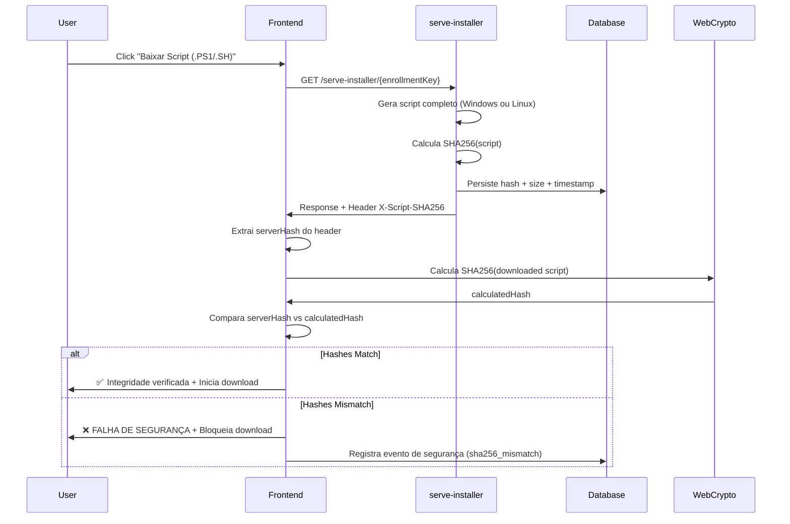

# 🔒 Validação de Integridade SHA256 - Scripts de Instalação

## 📋 Visão Geral

Todos os scripts de instalação **Windows (.PS1) e Linux (.SH)** do CyberShield Agent passam por validação SHA256 end-to-end para garantir integridade e prevenir ataques MITM (Man-in-the-Middle), corrupção de dados e execução de código malicioso.

## 🏗️ Arquitetura de Validação

### Componentes

1. **Backend: `serve-installer` Edge Function**
   - Gera o script de instalação completo (Windows ou Linux)
   - Calcula o hash SHA256 do script final
   - Persiste o hash no banco de dados (`enrollment_keys.installer_sha256`)
   - Retorna o hash no header HTTP `X-Script-SHA256`

2. **Backend: `auto-generate-enrollment` Edge Function**
   - Retorna metadados do instalador incluindo `installerSha256` e `installerSizeBytes`
   - Permite que o frontend tenha conhecimento prévio do hash esperado

3. **Frontend: `AgentInstaller.tsx`**
   - Baixa o script via `serve-installer` (Windows .PS1 ou Linux .SH)
   - Extrai o hash do header `X-Script-SHA256`
   - Calcula o SHA256 local usando Web Crypto API
   - Compara os hashes
   - Exibe feedback visual ao usuário
   - Bloqueia o download se os hashes não corresponderem

4. **Database: `enrollment_keys` table**
   - Coluna `installer_sha256` (TEXT): Hash SHA256 do instalador
   - Coluna `installer_size_bytes` (INTEGER): Tamanho em bytes
   - Coluna `installer_generated_at` (TIMESTAMPTZ): Timestamp de geração

---

## 🔄 Fluxo de Validação

### Download Manual (Recomendado) ✅



**Passo a Passo:**

1. Usuário clica em "Baixar Script (.PS1/.SH) com Validação SHA256"
2. Frontend chama `serve-installer` via fetch
3. Backend gera script (Windows ou Linux), calcula SHA256 e persiste no DB
4. Backend retorna script com header `X-Script-SHA256: <hash>`
5. Frontend extrai hash do header
6. Frontend calcula SHA256 do script baixado usando `crypto.subtle.digest`
7. Frontend compara `serverHash` vs `calculatedHash`
8. **Se iguais:** ✅ Toast verde + Download prossegue + Hash exibido no UI
9. **Se diferentes:** ❌ Toast vermelho crítico + Download bloqueado + Evento de segurança registrado

---

### One-Click Command (Sem Validação) ⚠️

**Windows PowerShell:**
```bash
irm https://api.cybershield.com/functions/v1/serve-installer/{key} | iex
```

**Linux Bash:**
```bash
curl -sL https://api.cybershield.com/functions/v1/serve-installer/{key} | sudo bash
```

**⚠️ AVISO CRÍTICO:**

O comando `irm | iex` (Invoke-RestMethod | Invoke-Expression) executa o script diretamente sem validação SHA256 no cliente. Isso ocorre porque o script é executado em pipeline sem salvá-lo em disco.

**Riscos:**
- Vulnerável a ataques MITM se HTTPS for comprometido
- Sem validação de integridade client-side
- Sem registro de hash no histórico local

**Recomendação:**
- **Para ambientes de produção:** Use SEMPRE o download manual com validação SHA256
- **Para testes rápidos:** One-click é aceitável, mas com consciência dos riscos
- **Para máxima segurança:** Download manual + Verificação manual do hash (ver seção abaixo)

---

## 🔍 Verificação Manual do Hash

Se você baixou o script manualmente e quer verificar a integridade antes de executar:

### Windows PowerShell

```powershell
# Calcular SHA256 do arquivo
$hash = (Get-FileHash -Path ".\cybershield-installer-agent.ps1" -Algorithm SHA256).Hash
Write-Host "SHA256 Calculado: $hash"

# Compare com o hash exibido no dashboard CyberShield
# Eles devem ser IDÊNTICOS (case insensitive)
```

### Linux Bash

```bash
# Calcular SHA256 do arquivo
sha256sum ./cybershield-installer-agent.sh

# Compare com o hash exibido no dashboard CyberShield
# Eles devem ser IDÊNTICOS
```

### Onde encontrar o hash esperado?

1. **Dashboard CyberShield**: Após gerar o script, o hash é exibido na seção "Integridade Verificada" (verde)
2. **API Response**: Campo `installerSha256` na resposta de `auto-generate-enrollment`
3. **Database**: Query direta à tabela `enrollment_keys`

```sql
SELECT installer_sha256, installer_size_bytes, installer_generated_at
FROM public.enrollment_keys
WHERE key = '<enrollment_key>';
```

---

## 📊 Eventos de Segurança

Falhas de validação SHA256 são registradas na tabela `security_logs` como eventos críticos:

```json
{
  "event_type": "sha256_mismatch",
  "severity": "critical",
  "resource_type": "installer_script",
  "resource_id": "<enrollment_key>",
  "details": {
    "expected_hash": "a1b2c3d4...",
    "calculated_hash": "x9y8z7w6...",
    "script_size": 125678
  }
}
```

### Monitoramento

Admins podem monitorar falhas de validação em:
- **Security Dashboard**: `/admin/security`
- **Security Logs**: `/admin/audit-logs` (filtro: `event_type=sha256_mismatch`)
- **Alerts**: Emails automáticos são enviados para eventos `severity=critical`

---

## 🎯 Casos de Uso

### 1. Instalação em Produção (Alta Segurança)

```
1. Gerar credenciais no dashboard
2. Baixar script .PS1 com validação SHA256
3. Verificar hash exibido no UI (verde)
4. [Opcional] Verificar hash manualmente via PowerShell
5. Executar script como administrador
```

### 2. Testes Rápidos (Baixa Segurança)

```
1. Gerar comando one-click
2. Executar diretamente: irm <url> | iex
3. ⚠️ Sem validação SHA256
```

### 3. Auditoria de Segurança

```
1. Baixar script
2. Calcular SHA256 localmente
3. Comparar com hash no banco de dados
4. Verificar timestamp de geração
5. Analisar logs de security_events
```

---

## 🔐 Considerações de Segurança

### ✅ O que a validação SHA256 garante?

- **Integridade**: O script não foi modificado após geração
- **Autenticidade**: O script foi gerado pelo backend legítimo
- **Detecção de MITM**: Qualquer modificação em trânsito será detectada
- **Auditabilidade**: Hash é persistido e rastreável

### ❌ O que a validação SHA256 NÃO garante?

- **Confidencialidade**: O script não é criptografado (apenas HTTPS)
- **Proteção de chave HMAC**: Se o backend for comprometido, a validação ainda passará
- **Proteção contra backdoors**: Se o template original contiver código malicioso, o hash validará corretamente

### 🛡️ Camadas de Segurança Adicionais

1. **HTTPS/TLS**: Criptografia em trânsito
2. **HMAC Secrets**: Autenticação de agentes via HMAC-SHA256
3. **Enrollment Keys Expiring**: Keys expiram em 24h
4. **RLS Policies**: Controle de acesso granular no database
5. **Rate Limiting**: Previne brute force e DoS
6. **IP Blocklist**: Bloqueio automático de IPs maliciosos

---

## 📚 Referências Técnicas

- **Web Crypto API**: [MDN - SubtleCrypto.digest()](https://developer.mozilla.org/en-US/docs/Web/API/SubtleCrypto/digest)
- **SHA-256**: [FIPS 180-4 Secure Hash Standard](https://nvlpubs.nist.gov/nistpubs/FIPS/NIST.FIPS.180-4.pdf)
- **PowerShell Get-FileHash**: [Microsoft Docs](https://learn.microsoft.com/en-us/powershell/module/microsoft.powershell.utility/get-filehash)

---

## 🤝 Suporte

Para dúvidas sobre validação SHA256 ou eventos de segurança:
- **Email**: security@cybershield.com
- **Documentação**: `/docs/security`
- **Dashboard**: `/admin/security`

---

**Última Atualização:** 2025-01-13  
**Versão:** 1.0.0  
**Autor:** Rafael Costa - Engenharia de Segurança CyberShield
